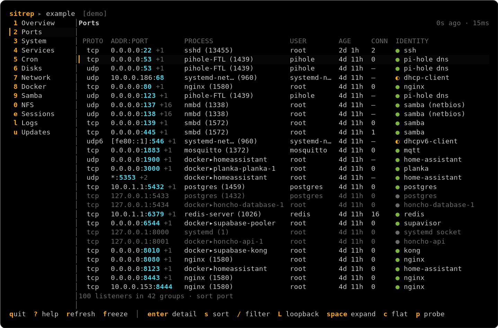
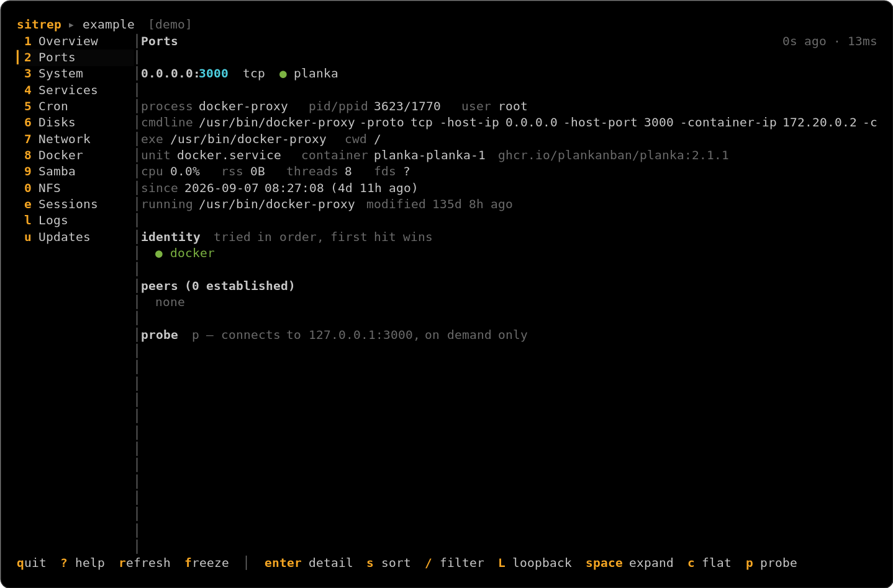
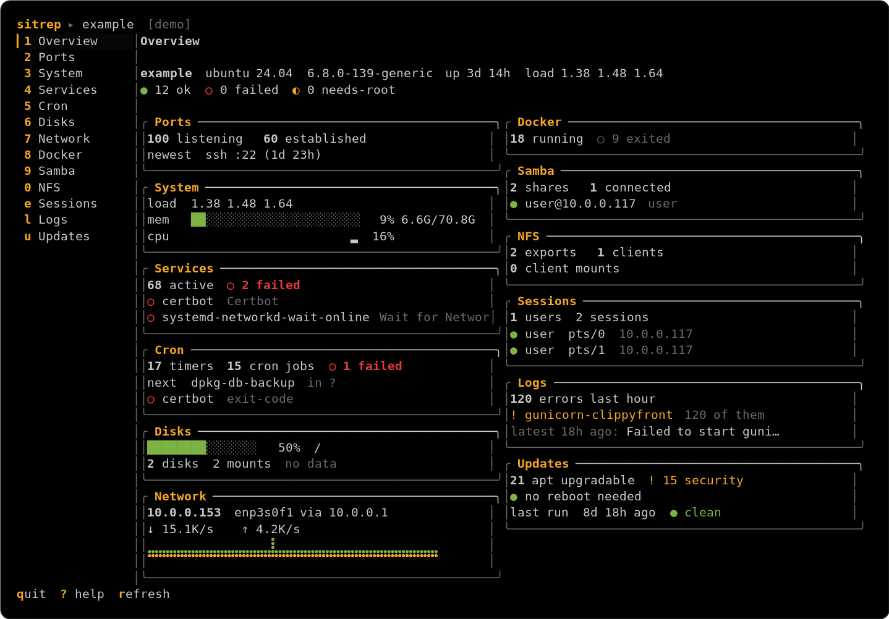
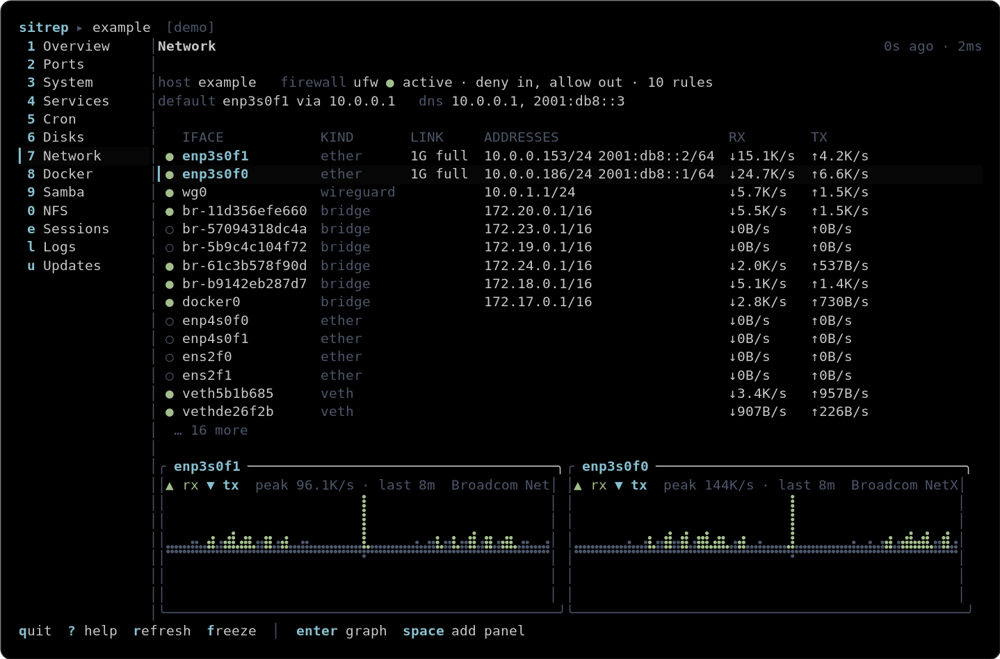
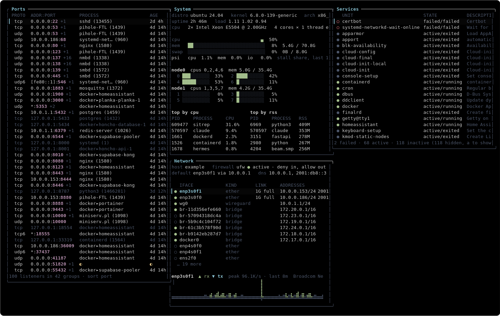
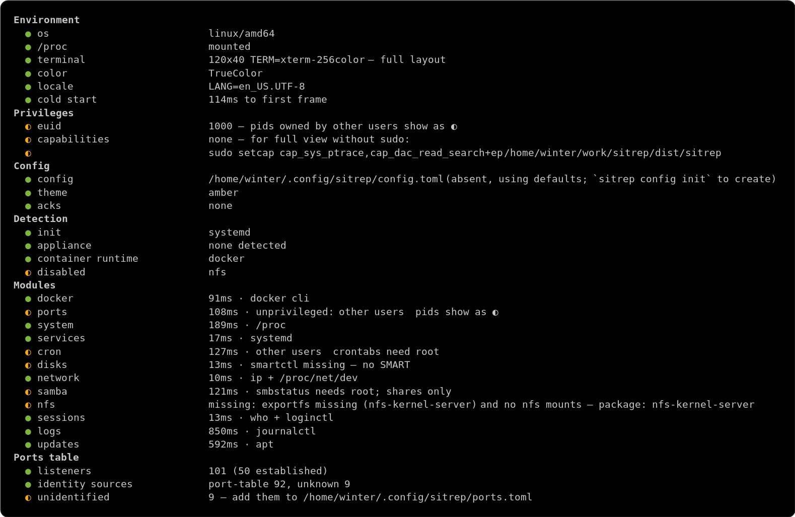

# sitrep

A read-only terminal situation report for a Linux box. Open it first, learn
what the machine is doing and whether it is healthy, close it. Depth lives in
`btop` and `netwatch`; sitrep is about **identity and status**.



`make gif` renders `docs/demo.tape` with [vhs](https://github.com/charmbracelet/vhs)
into `docs/sitrep.gif` (not committed; needs vhs, ttyd, ffmpeg).

```
sitrep                  # the TUI
sitrep --lite           # 80x24, no sidebar
sitrep --view dense     # zero-chrome grid of your dense_modules (130x44+)
sitrep --demo           # bundled fixtures, no host access
sitrep --once ports     # one frame to stdout, for scripts and screenshots

sitrep doctor           # what works, what needs root, what is missing
sitrep why              # plain-English findings and which tab to open; exit 1 on crit
sitrep ports --json     # any module as a one-shot table or JSON
sitrep snapshot         # every module as JSON
sitrep diff old.json    # listeners, containers, units, mounts that changed since that snapshot
sitrep modules list     # id, state, reason
sitrep modules info ports
```

## The hero: Ports

What is listening, how long it has been there, and what it probably is.



```
 PROTO  ADDR:PORT               PROCESS              USER    AGE     CONN  IDENTITY
  tcp   0.0.0.0:22 +1           sshd (13455)         root    12d 4h  2     ● ssh
  tcp   0.0.0.0:3000 +1         docker▸planka        root    3d 2h   0     ● planka
  tcp   127.0.0.1:11434         ollama (8871)        winter  6h 12m  0     ● ollama api
  udp   0.0.0.0:137 +16         nmbd (1338)          root    12d 4h  —     ● samba (netbios)
  tcp   0.0.0.0:8787            python3 (1466281)    winter  41m     0     ○ ? python3 -m app — likely dev server
```

- **AGE** is the owning process's start time. The kernel does not expose
  socket age; this is the honest proxy.
- **IDENTITY** comes from, in order: the Docker port map (●), a process-name
  table (●), a curated port table you can extend in
  `~/.config/sitrep/ports.toml` (◐), `/etc/services` (◐), or a heuristic (○).
- Listeners sharing a process and port fold across addresses and IP families.
  `space` expands one, `c` shows the flat list.
- `enter` opens a detail pane: cmdline, cwd, exe, unit, container, peers, and
  what file is really running with its mtime. A binary replaced or a script
  edited since the process started is flagged: you are running old code.
- `p` in the detail pane probes `127.0.0.1:<port>` (HEAD / or a banner read).
  That is the only outbound network activity sitrep ever performs, and only
  on keypress.

## Modules

Overview · Ports · System · Services · Disks · Network · Docker · Samba ·
NFS · Sessions · Logs · Updates. Each ships with a collector, a parser, a
captured fixture, parser tests, an Overview card, a tab, and
`sitrep modules info <id>`.



Network keeps 20 minutes of per-interface rates and draws them as a mirrored
braille graph, rx up and tx down. `enter` graphs the selected interface,
`space` adds it as a side-by-side panel.



`--view dense` drops the chrome and tiles your `dense_modules` into a grid
for the big monitor.



Unprivileged is the default experience: whatever needs root shows `◐`, never
an error. `sudo sitrep` or the `setcap` line `doctor` prints unlocks the rest.



## Keys

```
1-9,0   jump to tab        letters   tabs past ten (shown in sidebar)
tab / shift-tab            next / prev tab
j/k ↑/↓ move selection     enter     open detail        esc   back
/       filter             s         cycle sort         r     force refresh
?       help overlay       q         quit
```

Tab-local keys are listed in the footer after `│`.

## Install

```
make build && make install        # ~/.local/bin/sitrep, static, CGO_ENABLED=0
sitrep completion bash > ~/.local/share/bash-completion/completions/sitrep
```

Or grab a release tarball (linux/amd64, linux/arm64). One static binary,
scp it anywhere with a `/proc`.

## Configuration

CLI only; the TUI has no settings screen.

```
sitrep config init | path | show | edit
sitrep theme list | show | set <name>       # amber (default), mono, nord, terminal, or yours
sitrep modules enable <id> | disable <id>   # appliance-sensitive modules ask once
```

See [docs/THEMING.md](docs/THEMING.md) for theme files and
[docs/HANDOFF.md](docs/HANDOFF.md) for the design contract.

## Development

Develop on the box you monitor. `make lint test screenshot` is the gate;
`sitrep doctor` must be clean unprivileged and as root before a phase ends.
Fixtures are captured from the live host with
`SITREP_CAPTURE_FIXTURES=1 sitrep snapshot` and scrubbed by
`scripts/redact-fixtures.py`. `--demo` runs those fixtures through the real
parsers, so it doubles as an integration test of the render path.
`make shots` re-renders the images above from `--demo` frames through
`scripts/ansi2svg.py` and ImageMagick; `--once --keys j,enter` presses keys
before the frame is captured.

Read-only, always. Actions are a v2 conversation (docs/DECISIONS.md).

## License

MIT. See [LICENSE](LICENSE).
